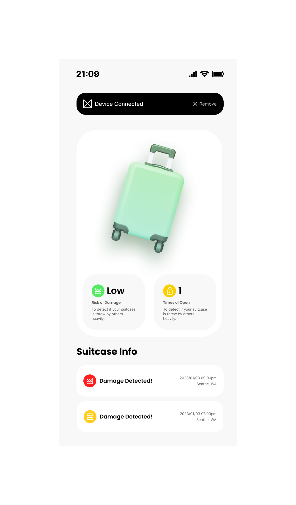
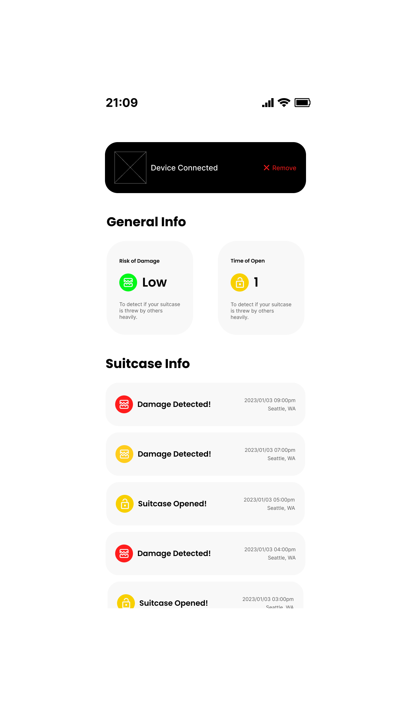

# BAGO: Peace of Mind on the Go

## Introduction

BAGO is a device designed to provide travelers with peace of mind by allowing them to monitor and protect their checked luggage during flights. This project aims to address the problem of lost, mishandled, and stolen luggage, which causes significant anxiety and inconvenience to travelers.

## Problem Statement

- **684,000** lost and mishandled bags at major US airlines in the first quarter of 2022 alone.
- The reimbursement process for mishandled and lost bags can take over **21 days**.
- **$1.2 billion** worth of baggage was potentially lost or stolen in airports in 2018.

## Target Audience

1. Travelers who experience anxiety about their luggage.
2. Individuals looking for a reliable and easy-to-use solution to monitor and protect their belongings.

## Design Question

**"How might we design a solution that allows travelers to easily monitor and protect their checked bag during flights, to reduce the anxiety of lost or damaged belongings?"**

## Hardware Architecture

- **ESP 32**
- **MPU 6050 Accelerometer**: Monitor the number of impacts to checked baggage during flights
- **Photoresistor**: Monitor the number of times checked baggage is opened during flights
- **LM317 Regulator**

## Software Architecture

- **Bluetooth**: Use Bluetooth to transmit data collected during flights.
- **Firebase Integration**: Store processed data in Firebase.
- **Android Mobile App**: Receives and displays alerts and notifications to users.
- **Data Processing Pipeline**: Use a complementary filter for the IMU to remove accelerometer spikes and ensure more consistent and accurate data.

## APP UI
 

